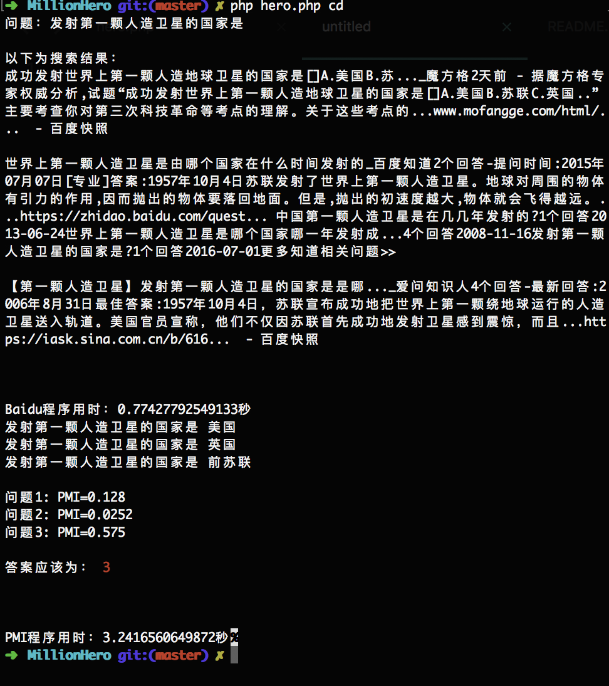

# 百万英雄、冲顶大会、芝士超人答题助手
----------------------------------------------------------------------------------------------

## 我的使用环境是Mac Pro+PHP7.1 （该脚本只支持安卓手机，适配1080*1920机型（其他机型未测试，欢迎提交issue））

本项目参考 https://github.com/wuditken/MillionHeroes ，优化了截图速度，大概提高0.6秒，原理是通过adb截图，通过百度OCR识别接口返回具体问题和答案内容，然后通过百度接口获取前三个结果，仅供参考。

另外增加PMI答题程序，其原理为：使用百度搜索并统计搜索得到结果数量

问题+各个答案count(q&a)；

问题 count(q)；

答案 count(a)；

计算匹配值pmi: pmi[i]=count(q&a[i])/(count(q)*count(a[i]))

选择pmi值最高的为答案，如果pmi值大于1则剔除（有可能是OCR识别错误导致）。

该公式的依据来自于维基百科: https://en.wikipedia.org/wiki/Pointwise_mutual_information

## 把问题区域裁剪出来后用百度的ocr识别出文本，然后调用百度搜索（可以同时打开浏览器,代码已经注释）

## 整个程序运行完估计3-4秒左右，其中百度搜索只需要2-3秒，还可以有时间答题（---）

## 使用教程

1.安装ADB 驱动，可以到[这里下载](https://adb.clockworkmod.com/) 
	安装 ADB 后，请在环境变量里将 adb 的安装路径保存到 PATH 变量里，确保 adb 命令可以被识别到
Mac 可以使用 brew cask install android-platform-tools

2.在hero.php里填写自己百度ocr的APP_ID/API_KEY/SECRET_KEY 
	百度ocr：http://ai.baidu.com/tech/ocr/general

3.连接手机，打开开发者调试模式 运行php hero.php {答题APP简称} （百万英雄为bw，冲顶大会为cd，芝士超人为zs）

## 注意： 优先使用Baidu搜索结果，PMI程序结果不准确

